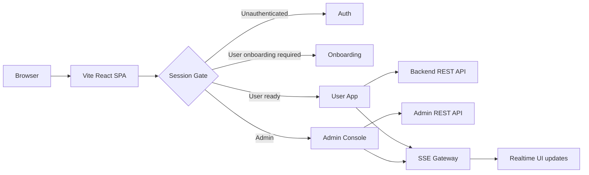

<div align="center">

# Maily Web Front

EmailAssist Web Front

Gmail 기반 업무 메일을 분류하고, AI 답장 초안과 일정 후보를 한 화면에서 검토하는 React 웹 클라이언트입니다.


[Overview](#overview) · [Features](#features) · [Quick Start](#quick-start) · [Routes](#routes) · [Tech Stack](#tech-stack)

</div>

## Overview

`Web_Front`는 Maily 사용자 업무 화면과 관리자 운영 콘솔을 함께 제공하는 Vite 기반 SPA입니다.

사용자는 로그인 후 Gmail 계정을 연결하고, 온보딩에서 회사 프로필과 FAQ, 자료, 카테고리를 입력합니다. 앱 화면에서는 수신 메일, AI 답장 초안, 일정 후보, 템플릿, 자동화 규칙을 검토합니다. 관리자는 같은 번들 안의 `/admin/*` 경로에서 사용자, 문의, 템플릿 자동화, 운영 지표, 내부 진단 이벤트를 확인합니다.

| Area | Role | Entry |
| --- | --- | --- |
| Auth | 로그인, 회원가입, 비밀번호 재설정, Google 인증 회원가입 | `/` |
| Onboarding | Gmail 연동, 회사 프로필, FAQ/자료 입력, 카테고리/템플릿 준비 | `/onboarding` |
| User App | 수신함, 캘린더, 템플릿, 자동화, 프로필, 설정 | `/app/*` |
| Admin Console | 운영 대시보드, 사용자, 문의, 자동화, 모니터링 | `/admin/*` |
| SSE | 메일 분석, RAG 작업, 문의, 알림, 진단 이벤트 반영 | `/sse/connect` |

## Features

| Feature | Description |
| --- | --- |
| 세션 기반 진입 제어 | 로그인 상태, 관리자 권한, 온보딩 완료 여부에 따라 `/`, `/onboarding`, `/app`, `/admin`으로 분기합니다. |
| Google 계정 흐름 | Google OAuth callback과 Google 인증 회원가입 경로를 별도로 처리합니다. |
| 수신함 워크스페이스 | 메일 목록, 상세 본문, 요약, 분류 상태, AI 답장 초안, 일정 후보 액션을 제공합니다. |
| AI 초안 검토 | 생성된 답장 초안을 사용자가 검토하고, 발송/스킵/미발송 이동 흐름으로 처리합니다. |
| 일정 관리 | 메일에서 감지된 일정 후보를 캘린더 등록 흐름으로 연결하고 일정 CRUD 화면을 제공합니다. |
| 템플릿 라이브러리 | 생성된 템플릿 조회, 미리보기, 수정, 삭제, 재생성 흐름을 제공합니다. |
| 자동화 설정 | 카테고리 규칙, 자동 발송, 캘린더 연동 기준을 화면에서 관리합니다. |
| 비즈니스 프로필 | 회사 설명, FAQ, 업로드 자료, 템플릿 재생성 입력을 관리합니다. |
| 사용자 설정 | 계정, 알림, 화면, 이메일 연동, 관리자 문의 탭을 제공합니다. |
| 관리자 콘솔 | 가입자/메일 처리 지표, 사용자 관리, 문의 답변, 템플릿 자동화, 시스템 모니터링을 제공합니다. |
| 실시간 이벤트 | `EventSource`로 분류 완료, RAG 작업, 템플릿 매칭, 알림, 진단 이벤트를 구독합니다. |
| 데모/캡처 시나리오 | `?scenario=...` 기반 상태 화면과 디자인 캡처용 시나리오 데이터를 유지합니다. |

## Quick Start

```bash
cd App
npm ci
cp .env.local.example .env.local
npm run dev
```

개발 서버는 기본적으로 `http://localhost:5173`에서 실행됩니다.

로컬 백엔드와 SSE Gateway를 함께 붙일 때는 `.env.local`을 아래처럼 둡니다.

```text
VITE_API_BASE_URL=
VITE_ADMIN_API_BASE_URL=
VITE_SSE_BASE_URL=
VITE_BACKEND_ORIGIN=http://localhost:8080
VITE_SSE_ORIGIN=http://localhost:8081
VITE_DEMO_MODE=false
```

`VITE_API_BASE_URL`과 `VITE_SSE_BASE_URL`을 비워두면 브라우저 요청은 같은 origin의 `/api`와 `/sse`로 나가고, Vite proxy가 각각 `VITE_BACKEND_ORIGIN`, `VITE_SSE_ORIGIN`으로 전달합니다.

## Routes

| Route | Screen |
| --- | --- |
| `/` | 로그인, 회원가입, 비밀번호 재설정 |
| `/auth/google/register` | Google 인증 결과 기반 회원가입 |
| `/oauth/google/callback` | Gmail/Calendar OAuth callback 처리 |
| `/onboarding` | 최초 설정 플로우 |
| `/app` | 사용자 대시보드 |
| `/app/inbox` | 메일 목록, 상세 메일, AI 답장 초안 |
| `/app/inbox/:emailId` | 특정 메일 상세 진입 |
| `/app/calendar` | 일정 관리 |
| `/app/templates` | 템플릿 라이브러리 |
| `/app/automation` | 자동화 설정 |
| `/app/profile` | 비즈니스 프로필 |
| `/app/settings` | 계정, 알림, 화면, 이메일 연동, 문의 설정 |
| `/admin` | 관리자 대시보드 |
| `/admin/users` | 사용자 관리 |
| `/admin/template-automation` | 템플릿 / 자동화 관리 |
| `/admin/inquiries` | 문의 대응 |
| `/admin/monitoring` | 운영 모니터링 |
| `/admin/internal-monitoring` | AI/RAG 작업, 메일 작업, SSE 진단 로그 |

## How It Works



## Folder Structure

```text
Web_Front/
├─ App/
│  ├─ src/
│  │  ├─ admin/        # 관리자 콘솔 레이아웃, 페이지, 스타일
│  │  ├─ app/          # 라우터, 앱 조립, 레거시 컴포넌트 진입점
│  │  ├─ entities/     # 이메일, 캘린더, 설정 등 도메인 모델
│  │  ├─ features/     # 수신함, 설정, 레이아웃 등 기능 단위 UI
│  │  ├─ pages/        # 라우트 페이지 엔트리
│  │  ├─ shared/       # API client, 세션, SSE, 공용 UI, 시나리오
│  │  └─ styles/       # 폰트, Tailwind, 테마, 전역 스타일
│  ├─ .env.local.example
│  ├─ package.json
│  ├─ vercel.json
│  └─ vite.config.js
├─ docs/
├─ architect.md
└─ README.md
```

## Tech Stack

| Layer | Technology | Role |
| --- | --- | --- |
| App | React 18, TypeScript, Vite | SPA 화면과 라우팅 |
| Routing | React Router 7 | 인증/온보딩/사용자/관리자 경로 분기 |
| Server State | TanStack Query, Axios | REST API 호출과 오류 처리 |
| Client State | Zustand | UI 상태 저장 |
| UI | Tailwind CSS 4, Radix UI, MUI Icons, Lucide | 화면 컴포넌트와 아이콘 |
| Realtime | Browser `EventSource` | SSE 이벤트 구독 |
| Test | Vitest | 화면 helper 로직 테스트 |
| Deploy | Vercel static SPA | 정적 번들 배포와 history fallback |

## Commands

`App/` 디렉터리에서 실행합니다.

```bash
npm run dev
npm run build
npm run preview
npm run typecheck
npm run test
npm run lint
```

## Environment

| Variable | Default / Example | Description |
| --- | --- | --- |
| `VITE_API_BASE_URL` | empty or `https://capstone.studylink.click` | 사용자 앱 API base URL |
| `VITE_ADMIN_API_BASE_URL` | empty or `https://admin.studylink.click` | 관리자 API base URL, 비어 있으면 사용자 API 값을 따릅니다. |
| `VITE_SSE_BASE_URL` | empty or `https://capstone.studylink.click` | SSE 연결 base URL |
| `VITE_BACKEND_ORIGIN` | `http://localhost:8080` | Vite 개발 서버의 `/api` proxy 대상 |
| `VITE_SSE_ORIGIN` | `http://localhost:8081` | Vite 개발 서버의 `/sse` proxy 대상 |
| `VITE_DEMO_MODE` | `false` | 일부 화면의 데모 데이터 사용 여부 |

`VITE_*` 값은 Vite 빌드 시점에 정적 번들에 포함됩니다. API key, OAuth client secret, JWT secret 같은 비밀값은 프론트엔드 환경변수에 넣지 않습니다.

## Deployment

Vercel 배포는 `App/vercel.json`의 SPA rewrite를 기준으로 합니다.

| Setting | Value |
| --- | --- |
| Root Directory | `App` |
| Build Command | `npm run build` |
| Output Directory | `dist` |
| History Fallback | `/(.*) -> /index.html` |

운영 배포에서는 `VITE_API_BASE_URL`, `VITE_ADMIN_API_BASE_URL`, `VITE_SSE_BASE_URL`, `VITE_DEMO_MODE`를 빌드 환경변수로 고정합니다.

## Docs

| Document | Role |
| --- | --- |
| [architect.md](architect.md) | 프론트엔드 통합 설계 문서 |
| [docs/README.md](docs/README.md) | 프론트-백엔드 연동 문서 인덱스 |
| [App/.env.local.example](App/.env.local.example) | 로컬/운영 환경변수 예시 |

## Caution

- 관리자 경로는 클라이언트 라우팅에서 접근을 제어하지만, 최종 권한 검증은 반드시 백엔드 API에서 수행해야 합니다.
- `VITE_*` 환경변수는 사용자 브라우저에 노출됩니다.
- Electron 전용 기능은 이 저장소가 아니라 `App_Front` 저장소에서 관리합니다.
- 로컬에서 실제 API를 확인하려면 `VITE_DEMO_MODE=false`와 Vite proxy 설정을 함께 확인해야 합니다.
